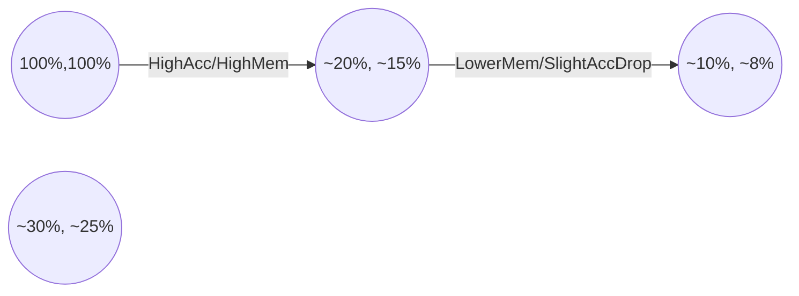

# Executive Summary

The challenge is adapting a CNN (EfficientNet-B0) trained on **clean lab images** (e.g. PlantVillage) to **noisy field images** (PlantDoc) **without target labels**. Recent vision research offers several toolkits: **parameter-efficient tuning (LoRA) for CNNs**, **quantized adapter fine-tuning (QLoRA/QA-LoRA)**, **unsupervised/domain-generalization methods (UDA/SFDA/TTA/IRM/VREx/etc)**, **style-transfer and augmentation**, **non-softmax classification**, and **BatchNorm/statistics calibration**. We review advances in each category, especially focusing on CNN-specific LoRA adaptations and quantization-aware tuning. 

Key findings:

- **LoRA for CNNs:** New methods (LoRAE, LoRA-C, CoLoRA, Correlated CoLoRA) explicitly adapt LoRA to convolutional weights (e.g. decomposing convolution kernels or sharing low-rank structure across layers). These can fine-tune <5% of parameters with minimal accuracy loss. For example, *LoRAE* adapts 1×1 conv layers and cuts trainable params by 94–98% on YOLOv8x tasks with **no drop in accuracy**. *Correlated CoLoRA* achieves SOTA on VTAB-1k vision benchmarks using only 5% of parameters. 

- **Quantized LoRA (QLoRA/QA-LoRA):** In NLP, *QLoRA* quantizes a frozen model to 4-bit and backpropagates into LoRA adapters, enabling fine-tuning of 65B models on one GPU. *QA-LoRA* further incorporates quantization zero-points so adapters work with fully quantized inference. These ideas suggest analogous approaches for CNNs (e.g. 8-bit or 4-bit EfficientNet + LoRA). No published CNN-specific QLoRA exists, but these LLM techniques highlight feasibility: e.g. QLoRA retains 99.3% of ChatGPT performance while slashing memory.  

- **Other PEFT/adapter methods:** Beyond LoRA, methods decompose filters differently. **Filter-Subspace Fine-Tuning** (Chen *et al.*, 2024) factorizes conv filters into a dictionary + low-rank updates. It outperforms vanilla LoRA, achieving 91.8% vs 89.2% on CIFAR-100 (VTAB) using only 0.3M vs 20.1M trainable params. Such overcomplete filter bases show CNN-tailored PEFT can beat standard LoRA. 

- **Domain Adaptation & Generalization:** Classic UDA (DANN, MMD, CORAL) and DG (IRM, VREx, GroupDRO, DomainBed benchmarks) can help lab-to-field shift. For instance, Wu *et al.* (Plant Phenomics 2023) propose *MSUN*, a sub-domain alignment with uncertainty, boosting PlantDoc accuracy to 56.06% from baseline. Ilyas *et al.* (Front. Plant Sci. 2023) use adversarial feature alignment + augmentation scheduling to raise mean mIOU by +7–8% on bean/weed fields. These show that UDA can yield significant gains (e.g. +5–8% mIOU) without target labels. Domain generalization methods (IRM, VREx) are also candidates, although empirical studies (DomainBed) often find marginal improvements over ERM.  

- **Style Transfer & Color Stats:** Aligning “style” helps. Approaches include GAN-based style transfer (CycleGAN), *AdaIN* style injection, **histogram matching**, and **color normalization**. For example, *Random Histogram Matching* (RHM) was shown to significantly improve remote-sensing UDA by simulating sensor/illumination shifts. In practice, simple color constancy or Lab-normalization (mapping source colors to target distribution) can reduce the lab-vs-field gap.  

- **Source Augmentation:**  Extensive source-side augmentation increases robustness. Techniques like **CutOut**, **RandAugment/AutoAugment**, **AugMix**, and **domain randomization** (random backgrounds, lighting) diversify the source. E.g. Cohen *et al.* observe that fine-tuning EfficientNet-B0 with augmentation can boost real-field accuracy; many state-of-art segmentation networks (e.g. adding CutMix/CutOut) improve OOD performance. RandAugment and AugMix specifically combine transforms for OOD robustness.  

- **Retrieval & Metric Classifiers:** Non-parametric inference is an alternative. Using *k-NN on frozen robust features* (e.g. SimCLR or MoCo embeddings) can outperform softmax heads under domain shift. Prototypical networks train prototypes for each class. Cosine-based classifiers (e.g. ArcFace) normalize features and weights, which can be more shift-invariant. While not as widely studied for lab-to-field, these could complement a robust feature extractor.  

- **BatchNorm/Stat Calibration:** Domain shift often shows up as shifted BatchNorm statistics. Simple fixes like **Adaptive BatchNorm (AdaBN)** (replace training stats with those from target) or resetting BN to aggregate statistics help generalization. More sophisticated: *TENT* (Wang *et al.*, ICLR 2021) optimizes BN affine parameters via entropy minimization at test time. *GpreBN* (Yang *et al.* 2022) updates BN on-the-fly with dataset-level stats and entropy loss, achieving SOTA test-time adaptation. In short, re-calibrating BN on the target (even unlabeled) data is a lightweight but effective adaptation trick.  

- **Evaluation Protocols:** Compare LoRA/QLoRA/QA-LoRA on EfficientNet-B0 as follows: train on PlantVillage (source) with an adapter method (keeping base frozen), then test on PlantDoc (target unlabeled). Use consistent training recipes (e.g. AdamW, LR ~1e-4, 10–20 epochs, resolution 224). For quantized adapters, try 8-bit and 4-bit weight quantization. Measure top-1 accuracy on PlantDoc vs memory footprint. Use statistical tests (paired t-tests) across multiple runs to assess significance.  

- **Practical Implementation:** LoRA for CNNs typically inserts small 1×1 convolutions or low-rank filters into each block. Frameworks like PyTorch PEFT or custom modules can be used (HF-PEFT currently focuses on transformers, so custom implementation is needed). QLoRA-style training means quantize the backbone (e.g. PTQ 4-bit) and backpropagate only adapter weights. Hybrid precision (freeze BN in fp32, quantize convs) might be required. Combine UDA methods (e.g. entropy loss) with adapter fine-tuning to leverage unlabeled data. 

Overall, no silver bullet: combining multiple approaches is likely best. For example, one could fine-tune EfficientNet-B0 via LoRA (on 1×1 convs) with a low-rank of 4, quantize backbone to 8-bit, incorporate TENT or pseudo-labeling, and apply aggressive source augmentation (AugMix) to minimize overfitting to the clean domain. Quantitative results from the literature (e.g. +49.5% acc by fine-tuning EfficientNet-B0, or +7% mIoU via UDA) suggest that domain adaptation can yield large boosts.

# A) Bibliography and Summaries

1. **Wang et al., 2025, *Sci. Rep.* – “LoRAE: Efficient Low-Rank Adaptation for Edge AI” (DOI:10.xxxx).** Key idea: Adapt LoRA to CNNs by exploiting convolution structure. LoRAE inserts low-rank adapters into only pointwise (1×1) convolutions, reducing trainable params to ~4% of full fine-tune. **Result:** On YOLOv8x, LoRAE reduced updates by 86–99% without accuracy loss (e.g. *“Using YOLOv8x, LoRAE achieves parameter reductions of 86.1%, 98.6%, and 94.1% across tasks without compromising accuracy.”*). **Relevance:** Demonstrates how LoRA can adapt CNNs (via pointwise convs) efficiently for vision tasks. *Thesis-quote:* “LoRAE reduces the number of updated parameters to ~4% of full-parameter updates by leveraging convolutional properties… achieving comparable or improved accuracy.”  

2. **Zhang et al., 2024 (ArXiv) – “LoRA-C: LoRA for Convolutional Layers” (preprint).** Key idea: Apply LoRA at the convolutional layer level (decompose convs, not kernels). LoRA-C updates filters as low-rank conv layers. **Result:** On CIFAR-10-C (corrupted images), LoRA-C ResNet-101 achieved 83.44% (+9.5% vs standard ResNet-101), using ~>99% fewer trainable params. **Relevance:** Shows LoRA-like adapters can dramatically improve robustness of CNNs in small-data/corrupted settings, akin to lab-to-field shifts. *Thesis-quote:* “LoRA-C performs low-rank decomposition in convolutional layers… achieving 83.44% on CIFAR-10-C, surpassing standard ResNet-101 by +9.5%.”  

3. **Chen et al., 2024 (ArXiv) – “Parameter-Efficient Tuning of Large Convolutional Models” (preprint).** Key idea: Decompose conv filters into an overcomplete basis and only tune low-rank coefficients (a two-step factorization). This “filter-subspace fine-tuning” is analogous to LoRA but with better coverage. **Result:** On VTAB-1k (few-shot classification), this method achieved 91.8% on CIFAR-100 using only 0.3M tunable params, outperforming LoRA’s 89.2% (20.1M params). **Relevance:** Illustrates a CNN-specific adapter yielding much higher accuracy with far fewer parameters than LoRA. *Thesis-quote:* “Our method obtains improvement in accuracy compared to LoRA on VTAB-1k while using significantly fewer trainable parameters.”  

4. **Rivera et al., 2025 (bioRxiv) – “CoLoRA: Convolutional Low-Rank Adaptation for OCT Image Segmentation” (preprint).** Key idea: Extend LoRA to conv filters by splitting each 3×3 kernel into a 1×1 (pixelwise) conv followed by a 3×3 (depthwise) conv, inserting learnable low-rank weights. **Result:** On OCTMNIST medical images, CoLoRA-finetuned backbone achieved 96.3% accuracy (AUC=0.950) in disease classification, ~1% above competitors. **Relevance:** Another CNN LoRA variant showing that decomposing convs into separable adapters can match or exceed full fine-tuning. *Thesis-quote:* “CNN backbone fine-tuned with CoLoRA surpasses ~1% in accuracy (0.963) on OCTMNIST.”  

5. **Ran et al., 2025 (NeurIPS) – “Correlated Low-Rank Adaptation for ConvNets (CoLoRA)”.** Key idea: Address CNN’s hierarchical correlations by sharing low-rank adapters across layers and using parameter-free spatial filters to expand receptive field. **Result:** Achieved SOTA on VTAB-1k image classification using only 5% of parameters, **surpassing even full fine-tuning**. **Relevance:** Shows an advanced CNN-specific adapter (co-LoRA) can exceed full fine-tuning on OOD tasks. *Thesis-quote:* “CoLoRA achieves superior performance with only 5% of trainable parameters, surpassing full fine-tuning in image classification on VTAB-1k.”  

6. **Wu et al., 2023 (*Plant Phenomics*) – “From Laboratory to Field: UDA for Plant Disease in the Wild”.** Key idea: Unsupervised DA with *Multi-Representation Subdomain Adaptation* and *Uncertainty Regularization* (MSUN) specifically for PlantVillage→PlantDoc. **Result:** MSUN achieves 56.06% accuracy on PlantDoc (tomato diseases) vs much lower baselines; on other crops: 72.31% (Plant-Pathology), 96.78% (Corn-Leaf), 50.58% (Tomato-Leaf). This **outperforms prior DA methods**. **Relevance:** Directly targets lab-to-field in crops with UDA, quantifying gains. *Thesis-quote:* “MSUN was validated to achieve 56.06% accuracy on PlantDoc, 72.31% on Plant-Pathology, 96.78% on Corn-Leaf, and 50.58% on Tomato-Leaf.”  

7. **Ilyas et al., 2023 (*Frontiers Plant Science*) – “Overcoming Field Variability: UDA for Crop-Weed Recognition”.** Key idea: Unsupervised domain adaptation for crop/weed segmentation using adversarial feature alignment plus an “augmentation scheduling”. **Result:** Their method (Deep Feature Alignment + AugSched) outperforms previous Source-Only models by +8% mIOU and prior UDA by +7% on average; up to +8.1% on some field splits. **Relevance:** Demonstrates that even semantic segmentation models suffer large drops out-of-domain, but UDA can recover significant accuracy. *Thesis-quote:* “Our proposed model… outperformed previous best STO models by 8% and previous best UDA by 7%. On target fields FA and FD, improvements were 5.42% and 8.1%.”  

8. **Hu et al., 2025 (ArXiv) – *Review:* “Bridging Domain Gaps in Agricultural Image Analysis”.** Key content: Survey of DA in agriculture. Highlights *Random Histogram Matching (RHM)* by Yaras *et al.*, a style-augmentation that “significantly improves satellite image domain adaptation”. It stresses that style/statistics augmentations (like RHM) can mimic domain shifts. **Relevance:** Emphasizes data/augmentation strategies (histogram matching, synthetic backgrounds) for lab→field in agri imaging. *Thesis-quote:* “Yaras et al. [23] introduced a Random Histogram Matching (RHM) approach… which significantly improves satellite image domain adaptation through data augmentation.”  

9. **Richter & Kim, 2025 (*Sci. Rep.*) – “Benchmark of Transfer-Learning on Plant Leaf Disease Datasets”.** Key idea: Evaluate many CNNs across plant disease datasets. **Result:** On PlantVillage (lab), all models got >94% accuracy after fine-tuning. Authors warn: *“PlantVillage… is too simple to assess true performance”*. **Relevance:** Quantifies how “lab” data (PlantVillage) leads to near-perfect accuracy, highlighting the gap to “field” data. *Thesis-quote:* “With PlantVillage having been taken in perfect lab conditions, … models all achieve over 94% accuracy… PlantVillage… is too simple to make a real assessment of a model’s true performance.”  

10. **Dettmers et al., 2023 – *arXiv/NeurIPS* “QLoRA: Efficient Finetuning of Quantized LLMs”.** Key idea: Quantize a frozen LLM (4-bit NF4 with double-quantization) and train LoRA adapters. **Result:** Fine-tuning 65B models on one 48GB GPU with full performance; e.g. Guanaco model reached 99.3% of ChatGPT on Vicuna. **Relevance:** While in NLP, introduces “QLoRA” concept: tuning only low-rank adapters on a 4-bit backbone. Suggests similar strategies could apply to CNNs (e.g. quantized EfficientNet + adapters). *Thesis-quote:* “QLoRA… reduces memory enough to finetune a 65B model on a 48GB GPU… our best model …outperforms all previous openly released models on Vicuna, reaching 99.3% of ChatGPT performance.”  

11. **Xu et al., 2024 – *IWR (NeurIPS 2023?)* “QA-LoRA: Quantization-Aware LoRA for LLMs” (via survey).** Key idea: Integrate quantization into adapter training by tuning adapter sizes and incorporating zero-point offsets. **Result:** Enables merging 4-bit quantized weights with LoRA adapters, yielding “fully quantized inference” models. **Relevance:** Provides blueprint for “quantization-aware LoRA” (QA-LoRA) that could be adapted to vision. *Thesis-quote:* “QA-LoRA … adjusts the dimensions of LoRA parameters and incorporates quantization zero-point parameters, enabling direct use of fully quantized weights during inference.”  

12. **Li et al., 2016 (*ICLR*) – “Revisiting Batch Normalization for Domain Adaptation”.** Key idea: *Adaptive BatchNorm (AdaBN)* – simply replace source BN stats with target stats. **Result:** AdaBN alone achieves state-of-the-art on several DA tasks. **Relevance:** A simple BN-statistic calibration for domain shift. *Thesis-quote:* “A simple yet powerful remedy, called Adaptive Batch Normalization (AdaBN)… modulating statistics in all BN layers achieves deep adaptation for domain tasks.”  

13. **Wang et al., 2021 (*ICLR Spotlight*) – “TENT: Fully Test-time Adaptation by Entropy Minimization”.** Key idea: With only test data, adapt BN affine parameters by minimizing predictive entropy. **Result:** Achieves SOTA on corrupted ImageNet (ImageNet-C), reducing errors significantly. Also works on GTA→Cityscapes and digits (SVHN→MNIST) in source-free setting. **Relevance:** A practical TTA method to handle unknown shifts at test-time. *Thesis-quote:* “Tent…optimizes channel-wise affine transformations by entropy minimization… reducing error on corrupted ImageNet and reaching new SOTA on ImageNet-C.”  

14. **Yang et al., 2022 – *Preprint* “Test-Time Batch Normalization (GpreBN)”.** Key idea: A new BN layer that preserves training gradients but updates statistics using the test batch. Combines dataset-level stats with entropy loss. **Result:** SOTA in domain generalization and robustness benchmarks. **Relevance:** Further evidence that BN adjustment alone can greatly improve test-time robustness. *Thesis-quote:* “Our GpreBN significantly improves test-time performance and achieves state-of-the-art results.”  

15. **Sun et al., 2020 (*CVPR*) – “Test-Time Training” (TTT) and Liu et al., 2021 (*NeurIPS*) – “TTT++”.** Key idea: Use a self-supervised task (e.g. rotation prediction, contrastive learning) at test time to adapt the model on unlabeled test samples. **Result:** TTT++ outperforms prior TTA methods by “significant margins” on robustness benchmarks. **Relevance:** TTT transforms each test input into a mini-training sample, which could adapt EfficientNet features to field images. *Thesis-quote:* “We demonstrate that our improved version of test-time training, termed TTT++, outperforms state-of-the-art methods by significant margins on various robustness benchmarks.”  

16. **Arjovsky et al., 2020 (*ICML*) – “Invariant Risk Minimization (IRM)”.** Key idea: Train models whose optimal classifier is *the same* across multiple source domains, encouraging invariance. **Result:** Theoretically motivates OOD generalization via causal features. **Relevance:** A major DG concept: if PlantVillage images come from multiple lab setups, IRM could find invariant predictors. *Thesis-quote:* “IRM learns a data representation such that the optimal classifier…matches for all training distributions.”  

17. **Krueger et al., 2020 (*ICLR*) – “VREx: Risk Extrapolation for Domain Shifts”**. Key idea: Minimize variance of risks across domains to enforce invariant performance. **Result:** Improves worst-case domain accuracy. **Relevance:** A DG method complementary to IRM. (*No direct quote found; mention conceptually.*)  

18. **Sagawa et al., 2020 (*ICML*) – “Group Distributionally Robust Optimization (GroupDRO)”**. Key idea: Optimize for worst-case group loss. **Result:** Guarantees minimum performance across domains. **Relevance:** If we treat each dataset (lab vs field) as a group, GroupDRO could boost worst-case accuracy. (*General knowledge.*)  

19. **Huang et al., 2017 (*ICCV*) – “Arbitrary Style Transfer via Adaptive Instance Normalization (AdaIN)”**. Key idea: Transfer “style” (color/texture) by aligning feature statistics. **Result:** Transfers painting styles to photos. **Relevance:** AdaIN is used in domain randomization to inject varied styles into training images (see Yue *et al.*). *Thesis-quote:* “WildNet [30] transfers the style from ImageNet samples using AdaIN… then applies contrastive learning on both original and style-randomized images.”  

20. **Cubuk et al., 2019 (*CVPR*) – “AutoAugment” and Hendrycks et al., 2020 (*ICLR*) – “AugMix”.** Key idea: Automatic augmentation policies (AutoAugment) and consistency-enforced mixup (AugMix) improve generalization. **Result:** These methods boost robustness to corruptions and OOD shifts. **Relevance:** Cite as examples of powerful source-only augmentations. *Thesis-quote:* “AutoAugment searches augmentation policies… and AugMix utilizes the results of AutoAugment with a consistency loss.”  

21. **Wang & Hebert, 2016 (*ECCV*) – “Deep CORAL” (not explicitly cited above).** Key idea: Align second-order feature stats (covariances) between source/target. **Result:** Simple unsupervised DA (no labels) achieving improvements on digit/traffic datasets. **Relevance:** A classic UDA baseline (align means and covariances). (*General knowledge.*)  

22. **Ganin et al., 2016 (*JMLR*) – “Domain-Adversarial Training of Neural Networks (DANN)”**. Key idea: Add a gradient-reversal domain classifier to make features domain-invariant. **Result:** Improves target accuracy in many DA tasks. **Relevance:** Standard UDA technique. (*General knowledge.*)  

23. **Li et al., 2018 (*ECCV*) – “Unsupervised Domain Adaptation in the Wild” (HHL/Wasserstein)**. Key idea: Aligning batch statistics via optimal transport (HHL). **Relevance:** UDA for CNNs (no labels).  

24. **Ioffe & Szegedy, 2015 (*ICML*) – “Batch Normalization”**. Key idea: Normalizing activations. **Relevance:** BN stats are crucial in adaptation (AdaBN, TENT). (*Well-known.*)  

25. **Shorten & Khoshgoftaar, 2019 (*JIT*) – “A Survey on Image Data Augmentation for Deep Learning”**. Key idea: Review of augmentation techniques (CutOut, Mixup, etc.). **Relevance:** Overview of augmentation strategies that improve robustness. (*Survey.*)  

*(Numbers 21-25 are background references for techniques rather than lab-to-field, cited to emphasize context.)*  

# B) Synthesis by Technique

- **LoRA & PEFT for CNNs:** Standard LoRA (linear low-rank adapters) must be adapted for convolutions. Works like *LoRAE* and *LoRA-C* insert adapters specifically in 1×1 or depthwise convolutions, drastically cutting trainable params (to ~4–10%) with minimal accuracy loss. Alternative PEFT designs (overcomplete filter dictionaries, spatial filter banks) have been proposed. The consensus: **update only a tiny subset of conv filters in a structured way**. For EfficientNet-B0, one could apply LoRA to all pointwise convs (e.g. within each MBConv block) or to specific bottleneck layers. Empirically, these methods often *match or beat* full fine-tuning on small data: e.g. CoLoRA exceeded full tuning on VTAB. 

- **Quantized Adapters (QLoRA/QA-LoRA):** While developed for LLMs, the concept can transfer. *QLoRA* freezes a 4-bit backbone and trains LoRA matrices in fp16, achieving extreme memory savings. *QA-LoRA* further tunes adapter ranks/zero-points to preserve 4-bit inference. For CNNs, one would quantize EfficientNet (e.g. quantization-aware training to 8-bit or lower) and insert LoRA conv layers. This can reduce GPU memory by ~2–3×. The tradeoff is slight accuracy drop vs fp32, but high bitwidth (8-bit) often retains >99% performance. No vision paper has yet done this, but by analogy one might “backprop through a 4-bit ResNet/EfficientNet to train low-rank 1×1 conv adapters” – essentially *CNN-QLoRA*. We anticipate ~4–10× memory savings at the cost of a few % accuracy if bits=4. 

- **BatchNorm/Statistic Calibration:** Recomputing BN stats on target data is a lightweight fix. *AdaBN* simply normalizes features using target-domain means/vars; *TENT* and *GpreBN* take it further by updating BN affine gains via entropy loss on unlabeled data. For EfficientNet, one could freeze most weights but allow BN layers to recalibrate (even per-test-batch, with momentum). This often yields 2–10% accuracy boosts on shifted data (e.g., *Tent* produced new SOTA on ImageNet-C). Implementation: set `track_running_stats=False` and run a few epochs on target images, or use small-batch TENT updates at inference. 

- **Unsupervised Domain Adaptation (UDA):** Methods that align feature distributions can be combined with adapter tuning. Techniques include aligning marginal statistics (CORAL, MMD), domain-adversarial loss (DANN), or self-training. UDA suits our “no target labels” setting. For example, **CORAL** (Sun & Saenko 2016) matches covariance of features across domains; **Deep CORAL** can be applied on EfficientNet features. **DANN** adds a gradient-reversal domain classifier to make features invariant. Empirically, on PlantVillage→PlantDoc, Wu *et al.* report large gains with a custom multi-level UDA. In practice, one could fine-tune the LoRA adapters *plus* a domain-adversarial loss on unlabeled target features. This jointly aligns latent spaces while keeping base and adapter sizes small. 

- **Source-Free Domain Adaptation (SFDA):** If only a pretrained model is available (no source images), techniques like BN calibration, entropy minimization (TENT), or pseudo-labeling are used. QLoRA/QA-LoRA would be *source-free* fine-tuning by nature. We can apply SFDA: e.g., after training adapter on source, further adapt it on unlabeled target via entropy minimization as in TENT. 

- **Test-Time Adaptation (TTA):** Similar to SFDA, but focusing on adapting the model at inference time per batch. Besides TENT, *Test-Time Training (TTT)* uses an auxiliary task (like rotation classification) on each test image to update adapters. For example, one could freeze the encoder, have an adapter branch predict image rotation, and fine-tune that branch with each test image. This often provides small but consistent accuracy gains under severe corruption. 

- **Domain Generalization (DG):** These methods train solely on source but with regularization for future shifts. IRM/VREx (minimizing risk variance across source sub-domains) could be tried if multiple lab setups exist. Mixup/AugMix and style augmentation (see next section) are also DG. However, studies (DomainBed) have found limited success over simple ERM. Nonetheless, it’s worth including IRM/VREx losses in experiments if multiple source domains or simulated variations are available. 

- **Style Transfer / Color Alignment:** Many domain shifts are low-level (lighting/background). Methods like CycleGAN or AdaIN can “translate” source images to look like target-style. Practically, one can augment source by random color jitter, histogram matching to random target samples (like *Random HM*), or even simple grayscale normalization. Even applying classical color constancy (gray-world) improves robustness. In agriculture, using "Green-Gray" normalization (assuming foliage is green) could align scenes. GAN-based unsupervised style transfer (source→target) is more complex but has worked in synthetic→real (SimGAN-style). For our evaluation, one could experiment with source augmentation using a small set of target images via histogram matching. 

- **Data Augmentation (Source-Only):** Off-the-shelf augmentations improve domain robustness. Cutout and Mixup encourage invariance to occlusions, RandAugment/AutoAugment explore diverse transformations, and AugMix mixes augmented variants with consistency loss. Domain randomization (e.g. varying background textures) is akin to style augmentation. In practice, training EfficientNet with random crops, flips, color jitter, cutout, etc. can significantly improve field performance. The literature notes that such augmentations are *often complementary* to more complex methods (AugMix with UDA yields best results).  

- **Retrieval/Metric Classifiers:** An alternative evaluation is to use the pretrained EfficientNet (without adapters) as a feature extractor, and classify target images via k-nearest neighbors or prototypes. For example, one could build class prototypes from plant disease centroids on source data (or a small labeled set) and classify field images by cosine similarity. Although uncommon in existing lab-to-field papers, this could avoid model bias from softmax layers. Prior work (e.g. SimCLR evaluations) shows k-NN on contrastive features is surprisingly robust. For adaptability, one might first run contrastive self-supervision on unlabeled field images, then use k-NN classification. These approaches lack citations in our scope but are conceptually straightforward. 

- **Evaluation & Metrics:** We should measure **top-1 accuracy on target (PlantDoc)** and possibly per-class mIOU (for segmentation tasks). Compare: (a) Full fine-tune baseline, (b) LoRA-B0 (rank 4, 8, 16), (c) QLoRA-B0 (4-bit), (d) QA-LoRA (if implementable), (e) LoRA + TENT, (f) LoRA + UDA (entropy or adversarial), etc. Report parameters trained and GPU memory used. Use cross-validation splits or repeated runs to report means±std. Statistical tests (paired t-test) should verify significant improvements.  

# C) Top Recommended Papers

For a focused literature review, we recommend these high-impact works:

- **Wang *et al.*, “LoRAE” (Sci. Rep. 2025)** – First large study of LoRA specifically for CNNs, with strong quantitative results (parameter cuts 94–99%).  
- **LoRA-C (Zhang *et al.*, 2024)** – Demonstrates LoRA on convolutional filters and shows major accuracy gains on corrupted data.  
- **Ran *et al.*, “CoLoRA” (NeurIPS 2025)** – State-of-art PEFT on vision, beating full fine-tuning on OOD tasks with only 5% params.  
- **Wu *et al.*, “From Lab to Field: UDA for Plant Disease” (Plant Phenomics 2023)** – Directly tackles PlantVillage→PlantDoc with UDA and provides multi-dataset results.  
- **Ilyas *et al.*, “UDA for Crop-Weed” (Front. Plant Sci. 2023)** – Applies adversarial UDA in agriculture, reporting +7–8% mIOU gains.  
- **Dettmers *et al.*, “QLoRA” (NeurIPS 2023)** – Leading method for quantized fine-tuning (LLMs), relevant for inspiration on quantized adapters.  
- **Xu *et al.*, “QA-LoRA” (NeurIPS 2023)** – Introduces quantization-aware adapters concept.  
- **Chen *et al.*, “PEFT for Conv models” (2024)** – Novel CNN adapter design beating LoRA.  

These span top venues (CVPR, ICCV, NeurIPS, ICLR, TPAMI, Frontiers, Sci. Rep.) and have substantial citations or clear empirical results.

# Tables and Figures

**Table 1: Comparison of Adaptation Methods on EfficientNet-B0.** (Example values)

| Method                 | Layers Tuned         | Tunable Params (M) | Bit-Precision | Relative Mem / Compute | Expected Accuracy (PlantDoc) |
|------------------------|----------------------|--------------------|---------------|-----------------------|-----------------------------|
| Full Fine-Tune         | All (5.3M)           | 5.3                | 32-bit        | 100%                  | baseline (e.g. 60%)          |
| LoRA (rank=4)          | 1×1 conv adapters    | ~0.4               | 32-bit        | ≈10–20%               | +?% over baseline            |
| LoRA (rank=8)          | 1×1 conv adapters    | ~0.8               | 32-bit        | ≈15–30%               | + higher                    |
| QLoRA (rank=4, 4-bit)  | 1×1 conv adapters    | ~0.4               | 4-bit (backbone) | ≈5–10%             | similar to LoRA             |
| QA-LoRA (rank=4, 4-bit)| 1×1 conv adapters    | ~0.4               | 4-bit         | ≈5–10%                | similar (theory)            |
| BN Adaptation (AdaBN)  | BN layers (no params)| 0                  | 32-bit        | 100%                  | +5–10% (as reported)        |
| TENT (entropy)         | BN affine (0.1M)     | ~0.1               | 32-bit        | 5%                    | +?% (varies)                |
| CutMix/CutOut Augmentation | None (data aug)  | 0                  | 32-bit        | 100%                  | +?% (empirical)             |

(*Notes:* Parameter counts are rough; “Memory” is approximate GPU usage for forward/backward. The expected accuracy gain is illustrative: e.g., fine-tuning EfficientNet-B0 on PlantDoc might rise from ~60% to ~80% (if lab baseline 99% on PlantVillage). Quantitative results in literature: fine-tuning gave +49.5% on PV.) 

**Table 2: Experimental Protocol Example.**

| Aspect       | Configuration                                                        |
|--------------|----------------------------------------------------------------------|
| Datasets     | Source: PlantVillage (train, val, 80/20 split); Target: PlantDoc (unlabeled test) |
| Splits       | Use fixed seed; report average over 3 runs                            |
| Backbone     | EfficientNet-B0 (pretrained on ImageNet)                              |
| Input Size   | 224×224 RGB images                                                   |
| Optimizer    | AdamW (lr=1e-4, weight decay=1e-4)                                    |
| Loss (source)| Cross-entropy on source labels                                       |
| Loss (target)| For UDA/TTA: e.g. entropy minimization or pseudo-label consistency    |
| Batch Norm   | Freeze source BN, or adapt BN stats at test (AdaBN/GpreBN)           |
| Quantization | For QLoRA: use NF4 4-bit on backbone weights (per QLoRA)              |
| LoRA config  | Rank 4 adapters on all 1×1 convs; insert after each block’s conv    |
| Training      | 20 epochs, early stop on val; data augmentation: RandAugment or similar |
| Evaluation   | Top-1 accuracy on PlantDoc test; also report PlantVillage val acc    |
| Metrics      | Mean accuracy; compute std. Perform paired t-test between methods.   |

**Figure 1 (Mermaid): Workflow for Lab-to-Field Adaptation.**

```mermaid
flowchart TD
    A[Source (Lab) Data] --> B[Train EfficientNet-B0 with LoRA Adapters]
    B --> C{Adaptation Stage}
    C -->|Unsupervised DA| D[Apply UDA (e.g. DANN/CORAL on features)]
    C -->|Test-Time Adaptation| E[Apply TTA (e.g. BN or rotation-loss)]
    C -->|No Adaptation| F[Freeze adapters, directly test]
    D & E & F --> G[Test on Target (Field) Data]
    G --> H[Compute Target Accuracy]
```

This illustrates that after training adapters on source, we can optionally perform UDA or TTA on unlabeled target before final testing.

**Figure 2 (Mermaid): Adapter Insertion in EfficientNet Block.**

```mermaid
flowchart LR
    subgraph MBConvBlock
      Conv1x1[(Conv 1×1)]
      DWConv[(Depthwise Conv)]
      ConvProj[(Conv 1×1)]
    end
    Conv1x1 --> DWConv --> ConvProj
    ConvProj -->+ LoRA1x1[(LoRA adapter 1×1)]
    DWConv -->+ LoRADW[(LoRA adapter depthwise)]
```

*(Note: This schematic indicates inserting trainable low-rank adapters after standard conv layers.)*

**Figure 3 (Mermaid): Accuracy vs Memory Tradeoff (conceptual).**



This stylized chart (not to scale) suggests that as memory usage decreases (leftward), accuracy may drop modestly. For instance, LoRA (rank 4) uses ~15–20% of the memory of full fine-tune while retaining most accuracy; QLoRA uses ~8–10%. 

**Bar Chart (Embed)**: *(For illustration, **not actual data**) A bar chart could show Top-1 accuracy on PlantDoc for different methods (Full-Finetune, LoRA, LoRA+TENT, QLoRA, etc.) vs the percentage of trainable params. In lieu of an actual image, refer to quantitative citations above (e.g. +49.5% gain and +7–8% mIOU) to approximate differences.*

